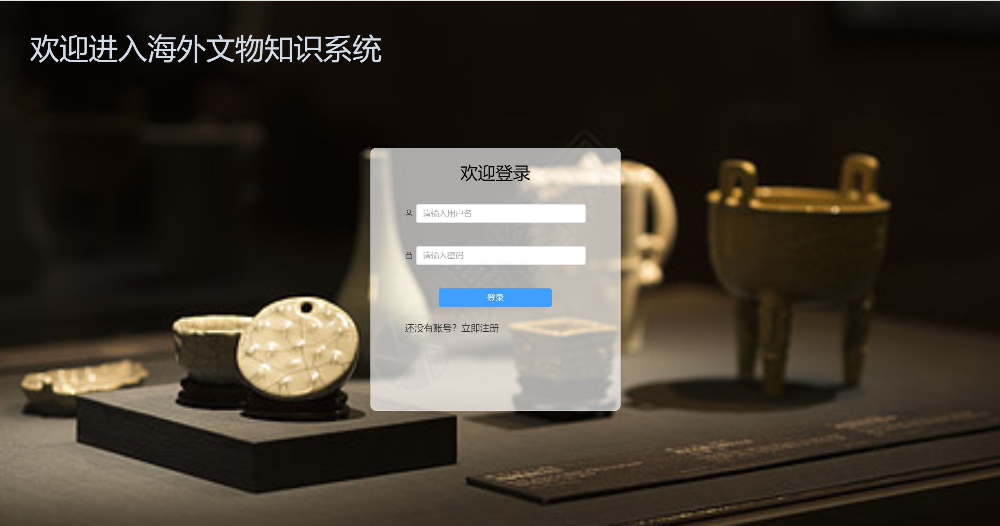
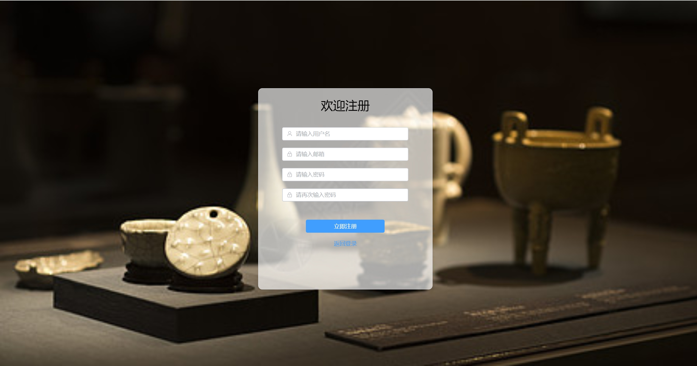
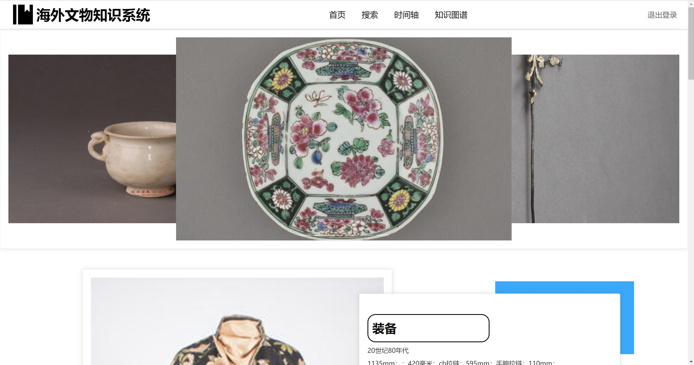
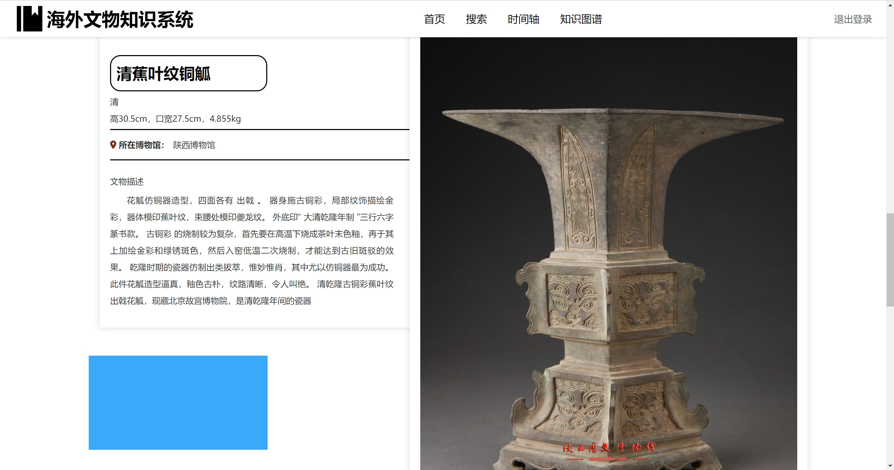
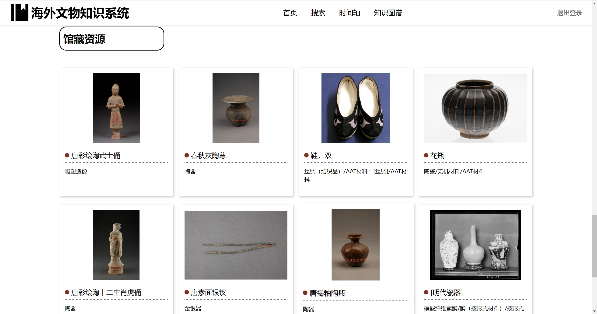
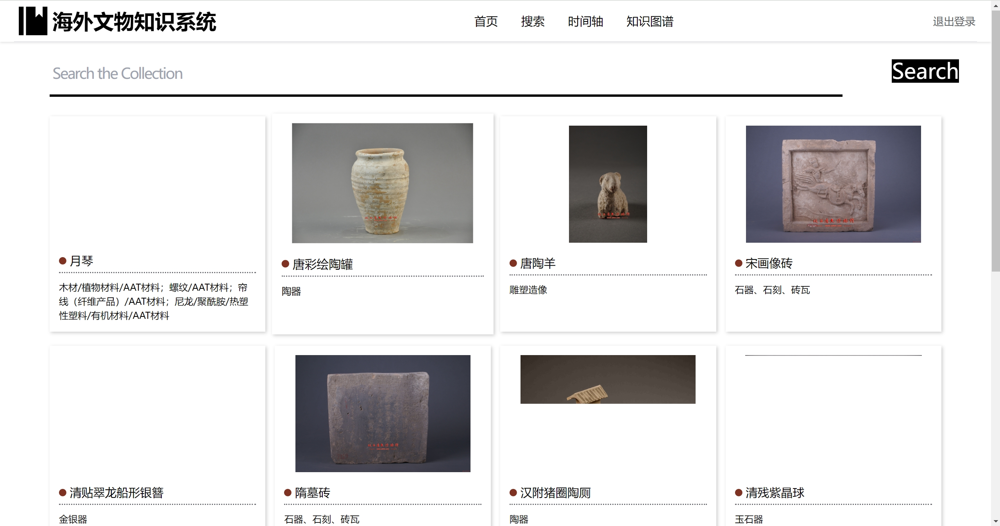
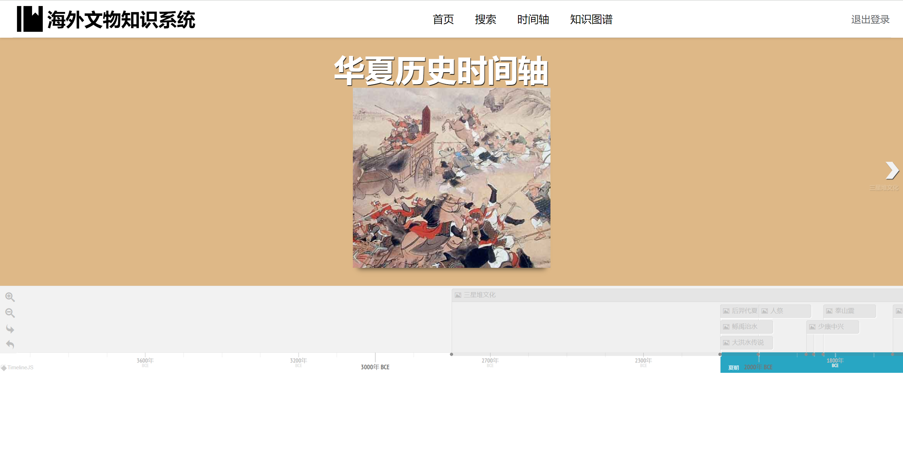
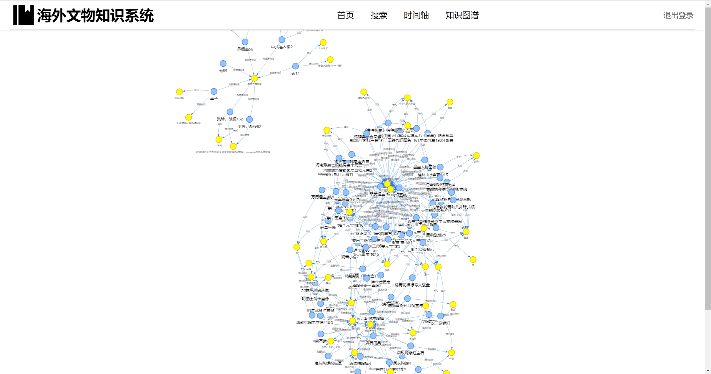
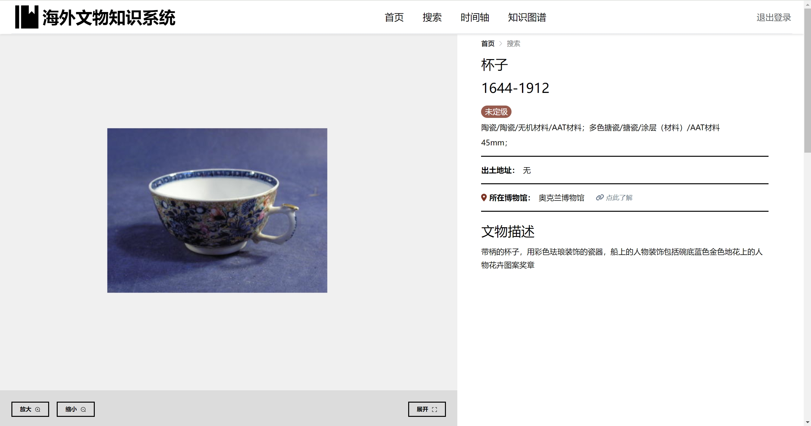
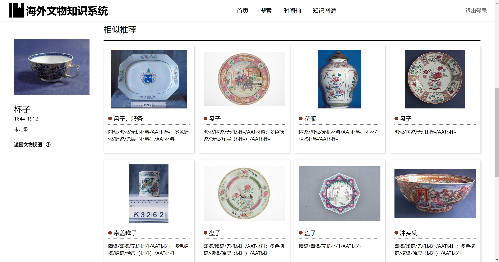

# 海外文物知识服务系统

## 1. 引言
### 1.1 编写目的

本用户手册的编写目的是为了帮助阅读者对网站更好的了解和使用，给予用户准确、明晰、简介的使用指导和说明，能够在一定程度上提高网站对于用户的亲和度和用户使用体验。

### 1.2 网页介绍

海外文物知识服务子系统，主要支持文物展示等功能。用户可以
在网页注册个人账号来查阅自己感兴趣的文物，网页主要包括以下功
能： 
-   文物浏览：显示文物的基本信息、图片等；可以进行按照关键字搜索的简单搜索。也可以按照文物年代进行搜索查询。可以对文物进行可视化浏览。 
-   用户个人信息管理：用户可以注册登录该系统，设置用户名密码等个人信息。
  
### 1.3 网站开发背景

随着经济不断发展，人民物质生活水平不断提高，在精神层面的需求随之不断膨胀。然而在当今疫情的大环境下，去博物馆近距离感受不同时代不同文物的魅力对大多数人而言成了一种困难。因此海外文物知识服务子系统可以在帮助我们足不出户便能够在一定程度上领略文物的魅力，丰富自己的精神生活。

### 1.4 网页开发环境
    Pycharm的前后端分离框架，前端Vue3框架，后端Django框架   

## 2. 网页的使用

### 2.1 网页的运行
    使用命令行启动Vue后即可使用

### 2.2 网页介绍

#### 2.2.1 登录

#### 2.2.2 注册

#### 2.2.3 首页

    用户点击轮播图可以跳转详情页面

---

#### 2.2.4 查询
用户键入关键字，搜索相关联的文物

#### 2.2.5 时间轴
用户通过滑动和点击，可以跳转到相应的时间段和页面

#### 2.2.6 知识图谱
通过拖动，用户可以看到文物之间的关系

#### 2.2.7 文物详情页
详情页的图片可以缩放大小，同时给出相似文物的推荐

